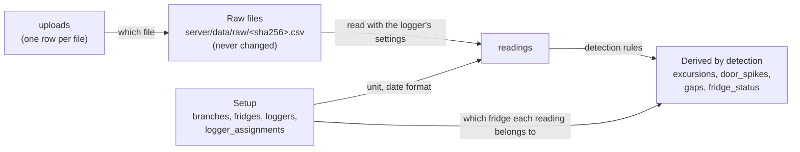
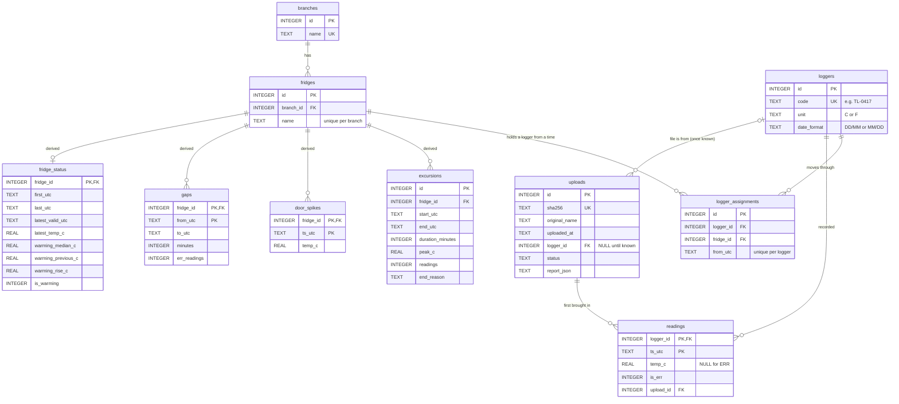

# ChillLog: the database

> Why SQLite, raw files and a rebuildable design: [`architecture-and-stack.md`](architecture-and-stack.md)
> §2 (Data storage), §3 (Raw files, upload & ingest flow) and §11 (Backup & recovery).
> This page describes what is actually in the database today. The schema itself is in
> [`server/migrations/`](../../server/migrations/).

## At a glance

- **One SQLite file**, opened with Node's built-in `node:sqlite` (no ORM, raw parameterized SQL).
- **Where:** `server/data/chilllog.db`, next to `server/data/raw/`, which holds the uploaded files.
  Set `DATA_DIR` to put both somewhere else. The folder is created on first start and is git-ignored.
- **On every connection:** `PRAGMA foreign_keys = ON` (SQLite leaves them off otherwise) and, for the
  file database, `PRAGMA journal_mode = WAL`.
- **Times** are UTC text in ISO-8601 (`2026-09-21T06:45:00Z`), so they sort correctly as text. The
  client shows them in Israel time.
- **Temperatures** are stored in °C. A °F logger's readings are converted when its file is read.
- **11 tables:** 4 for setup (branches, fridges, loggers, where each logger was when), 2 for data
  (uploads, readings), 4 derived by detection, and 1 for migrations.

## Three layers: what is the truth, and what can be rebuilt



| Layer | Tables | Rebuildable? |
| --- | --- | --- |
| **Source of truth** | Raw files on disk · `branches`, `fridges`, `loggers`, `logger_assignments` · `uploads` | No: this is what Summer entered or uploaded. Back it up. |
| **Data** | `readings` | Yes, from the raw files: `npm run rebuild`. |
| **Derived** | `excursions`, `door_spikes`, `gaps`, `fridge_status` | Yes, from `readings`: rebuilt on every change, and by `npm run rebuild`. |

A parsing bug or a rule change is fixed by re-running, never by asking the branches for their files
again.

## Tables and relations



The same diagram as an image, to open or share on its own:
[database-tables.png](database-tables.png). It is exported from the diagram above, so re-export it
when a migration changes the tables.

**The one relation to understand:** a reading has no fridge column. Readings belong to a **logger**,
and `logger_assignments` says which fridge that logger was in at each moment. So when the Tel Aviv
logger moves to the display fridge on Wednesday, its readings before Wednesday stay with the walk-in,
and later ones go to the display. Nothing is rewritten when a logger moves; only the derived tables
are recalculated.

## The tables

### Setup (entered in the Setup screen)

**`branches`**: one row per branch.

| Column | Type | Notes |
| --- | --- | --- |
| `id` | INTEGER PK | |
| `name` | TEXT, NOT NULL, UNIQUE | e.g. `Haifa`. The match is exact, so `haifa` would be accepted (see [NOTES.md](../../NOTES.md), "With one more hour"). |

**`fridges`**: one row per fridge, in one branch.

| Column | Type | Notes |
| --- | --- | --- |
| `id` | INTEGER PK | |
| `branch_id` | INTEGER, NOT NULL → `branches.id` | |
| `name` | TEXT, NOT NULL | e.g. `Display 2`. **UNIQUE (branch_id, name)**: two branches can each have a `Dairy`. The "type of fridge" filter is the name without its trailing number (`Display 2` → `Display`); it isn't stored. |

**`loggers`**: one row per temperature logger, and how its files are written.

| Column | Type | Notes |
| --- | --- | --- |
| `id` | INTEGER PK | |
| `code` | TEXT, NOT NULL, UNIQUE | The ID printed on the logger and found in its files, e.g. `TL-0417`. Stored normalized (upper case). |
| `unit` | TEXT, NOT NULL, default `C` | `C` or `F` (CHECK). The old Haifa logger is `F`. |
| `date_format` | TEXT, NOT NULL, default `DD/MM` | `DD/MM` or `MM/DD` (CHECK). |

**`logger_assignments`**: the move history. A logger is in a fridge **from** `from_utc` **until its
next row**; the latest row is where it is now.

| Column | Type | Notes |
| --- | --- | --- |
| `id` | INTEGER PK | |
| `logger_id` | INTEGER, NOT NULL → `loggers.id` | |
| `fridge_id` | INTEGER, NOT NULL → `fridges.id` | |
| `from_utc` | TEXT, NOT NULL | **UNIQUE (logger_id, from_utc)**. |

Rules enforced in code (`server/src/registry/registry.js`): a new row must be later than the logger's
current one, and to a different fridge, so the history only grows forward. A logger with no row is a
spare. Two loggers can be in the same fridge at once; their readings are combined (an open question
for Summer in NOTES.md).

### Data (from uploads)

**`uploads`**: one row per distinct file ever uploaded.

| Column | Type | Notes |
| --- | --- | --- |
| `id` | INTEGER PK | |
| `sha256` | TEXT, NOT NULL, UNIQUE | Hash of the file's bytes. The file itself is `raw/<sha256>.csv`, unchanged. Uploading the same file again is recognized here and adds nothing. |
| `original_name` | TEXT, NOT NULL | The name it was uploaded with. |
| `uploaded_at` | TEXT, NOT NULL | UTC. The latest one is the Overview's "Last upload". |
| `logger_id` | INTEGER → `loggers.id`, nullable | NULL until the file's logger is known. |
| `status` | TEXT, NOT NULL | `processed` · `needs_logger` (no logger ID found, or not registered yet: Summer picks it on the Upload screen) · `failed` (stored but held back, e.g. values look like °F on a °C logger). |
| `report_json` | TEXT | The per-file report shown after upload (readings added, already stored, ERR, duplicates, range, notes). |

**`readings`**: one row per logger per moment. `WITHOUT ROWID`, since the key is the natural one.

| Column | Type | Notes |
| --- | --- | --- |
| `logger_id` | INTEGER, NOT NULL → `loggers.id` | **PRIMARY KEY (logger_id, ts_utc)**: overlapping files and duplicate rows can't create a second reading (`INSERT OR IGNORE`). |
| `ts_utc` | TEXT, NOT NULL | Converted from the file's Israel local time. |
| `temp_c` | REAL | °C. NULL when the logger wrote `ERR`. |
| `is_err` | INTEGER, NOT NULL, 0/1 | 1 for an `ERR` row: kept, and counted as missing data. |
| `upload_id` | INTEGER, NOT NULL → `uploads.id` | The file that first brought this reading in. |

### Derived (by the detection rules, per fridge)

Recomputed for every affected fridge **in the same transaction** as the change that caused it, so the
screens never show a half-updated fridge. The thresholds are in `shared/src/thresholds.js`; the rules
are explained in NOTES.md, "Detection parameters".

**`excursions`**: each time a fridge was above 5°C (2 or more readings in a row).

| Column | Type | Notes |
| --- | --- | --- |
| `id` | INTEGER PK | |
| `fridge_id` | INTEGER, NOT NULL → `fridges.id` | **UNIQUE (fridge_id, start_utc)**. |
| `start_utc`, `end_utc` | TEXT, NOT NULL | The inspector's "when, and for how long". |
| `duration_minutes` | INTEGER, NOT NULL | |
| `peak_c` | REAL, NOT NULL | Highest temperature during it. |
| `readings` | INTEGER, NOT NULL | How many readings were above 5°C. |
| `end_reason` | TEXT, NOT NULL | How the end is known: `back_in_range` (first reading at or below 5°C) · `gap` (data stopped) · `data_ends` (still going at the last reading). |

**`door_spikes`**: single readings above 5°C (a door opening). Shown on the chart, never counted.
**PRIMARY KEY (fridge_id, ts_utc)**; columns `fridge_id`, `ts_utc`, `temp_c`.

**`gaps`**: stretches of more than 1 hour without a valid reading (ERR counts as missing).
**PRIMARY KEY (fridge_id, from_utc)**; columns `fridge_id`, `from_utc`, `to_utc`, `minutes`,
`err_readings`.

**`fridge_status`**: one row per fridge that has readings, so the Overview reads one small table.

| Column | Notes |
| --- | --- |
| `fridge_id` | PK → `fridges.id`. |
| `first_utc`, `last_utc` | First and last reading of any kind, ERR included ("did a file come in?"). |
| `latest_valid_utc`, `latest_temp_c` | The last reading with a temperature ("Latest 7.1°C at …"). |
| `warming_median_c`, `warming_previous_c`, `warming_rise_c` | Median of the last 24 h, of the 24 h before, and the rise between them. NULL when there isn't enough data to judge. |
| `is_warming` | 1 when the rise is at least 0.5°C. |

The week's status shown on the Overview (Alert, Warming, Gap, No file, OK) isn't stored. It's worked
out per request from these tables and the chosen week, because it depends on the week.

### Bookkeeping

**`schema_migrations`**: which migration files have run. Columns `name` (PK, the file name) and
`applied_at`. Created by the migration runner itself.

## Why detection results are their own tables, not columns on `fridges`

`excursions`, `door_spikes`, `gaps` and `fridge_status` all describe a fridge, so it can look natural
to put them on `fridges`. They are kept apart for four reasons:

1. **One fridge has many of them.** Over the weeks a fridge collects many excursions, gaps and door
   openings, each with its own start and end. A column on `fridges` holds one value. As rows, every
   one is kept with its times, so the inspector can ask about any date range, and the key
   (`fridge_id` + start time) keeps each fridge's list in time order.
2. **Different kinds of data, different rules.** `fridges` is what Summer entered: it's the truth and
   is never recalculated. Detection results are calculated: after every upload, logger move or
   rebuild, a fridge's rows are deleted and derived again from its readings
   (`recomputeFridge` in `server/src/detection/store.js`). In their own tables, that delete can't
   touch anything Summer entered, and a full rebuild simply empties the four tables.
3. **Rules can change without touching setup.** When a detection rule or threshold changes, only
   these tables are rebuilt (`npm run rebuild`). A new kind of result would be a new table, not a
   change to `fridges`.
4. **Speed on a phone.** Detection runs once, when the data changes, not on every page load. The
   Overview, fridge page and inspector read the stored results instead of re-running the rules over
   each fridge's whole history (readings grow by about 1.3 million a year); the Overview only loads
   the chosen week's readings, for its sparklines. See
   [architecture-and-stack.md](architecture-and-stack.md) §2.

`fridge_status` has just one row per fridge, but it's separate for the same reasons 2–4. It also means
a fridge with no readings yet simply has no row: the Overview reads it with a `LEFT JOIN`, gets NULLs,
and shows that fridge as "No file". On `fridges`, those would be empty columns on every new fridge.

## How a reading finds its fridge

The query every fridge screen is built on (`fridgeReadings` in `server/src/detection/store.js`): join
readings to the assignments of their logger, keeping each reading only between that assignment's
`from_utc` and the logger's next one.

```sql
SELECT r.ts_utc, r.temp_c, r.is_err
FROM logger_assignments a
JOIN readings r
  ON r.logger_id = a.logger_id
 AND r.ts_utc >= a.from_utc
 AND r.ts_utc < COALESCE(
       (SELECT MIN(next.from_utc) FROM logger_assignments next
        WHERE next.logger_id = a.logger_id AND next.from_utc > a.from_utc),
       '9999')
WHERE a.fridge_id = ?
ORDER BY r.ts_utc;
```

Readings from before a logger's first placement belong to no fridge. They are kept (the upload report
counts them as `beforePlacement`) and appear as soon as the logger is placed from an earlier date.

## What changes the database, and what it touches

Every write runs in a transaction: it all happens, or none of it does. Where an action also retries
waiting files, the action commits first and then each file is retried in its own transaction, like a
bulk upload, so one bad file can't undo the rest.

| Action (screen) | Writes | Then recomputes |
| --- | --- | --- |
| Add branch / fridge (Setup) | `branches` / `fridges` | – |
| Add logger (Setup) | `loggers`, and its first `logger_assignments` row if placed | Retries files waiting for this logger ID |
| Move a logger (Setup) | a new `logger_assignments` row | Every fridge the logger has been in |
| Change a logger's unit or date format (Setup) | `loggers` | Retries its held-back files |
| Upload files (Upload) | the raw file on disk, `uploads`, `readings` (each file in its own transaction) | The fridges of that file's logger |
| Pick the logger for a waiting file (Upload) | `uploads`, `readings` | The fridges of that logger |
| `npm run rebuild` | deletes and re-reads every reading from the raw files, in upload order | Every fridge |

Nothing in the app renames or deletes a branch, fridge or logger, or edits a reading. The only
deletes are of derived rows, and of `readings` during a rebuild.

## Migrations

- Numbered SQL files in [`server/migrations/`](../../server/migrations/), run in name order on every
  start by `server/src/db/migrate.js`. Each file runs in one transaction together with its
  `schema_migrations` row, so a failed file leaves no trace and is retried next start.
  - `001_core_tables.sql`: setup, uploads and readings.
  - `002_derived_tables.sql`: the four derived tables.
- **To change the schema, add the next file** (`003_….sql`). Never edit a file that has already run:
  it won't run again on existing databases.

## Reset, rebuild and back up

| Goal | How |
| --- | --- |
| Recalculate after a bug fix or rule change | `npm run rebuild`: all or nothing; refuses to start if a raw file is missing. |
| Fresh demo data | `npm run seed -- --reset`: deletes `chilllog.db` (with its `-wal`/`-shm` files) and `raw/`, then seeds. Without `--reset` it refuses to touch a database that has data. |
| Start empty | Stop the app and delete the data folder (`server/data/` or your `DATA_DIR`). It is recreated on the next start. |
| Back up | Copy the whole data folder (`chilllog.db`, any `-wal`/`-shm` files, and `raw/`) while the app is stopped. Automated backups are deferred (NOTES.md). |

## Known limits

- **Indexes:** only those that come with the primary keys and UNIQUE constraints. Fine for the demo
  data; not load-tested beyond it, so worth revisiting when hosted with more data.
- **Branch names are unique only as typed** ("Haifa" vs "haifa").
- **One writer at a time.** Fine for one user on one laptop; a move to Postgres is listed under
  "Deferred on purpose" in NOTES.md for when it's hosted with several users.
