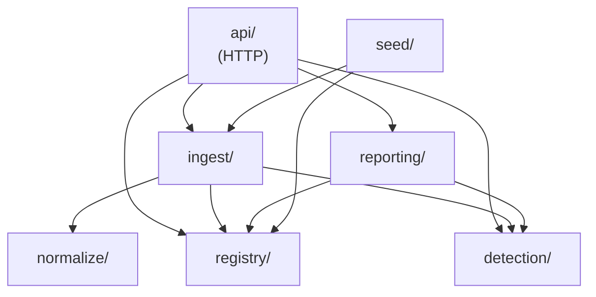

# ChillLog: project structure

> What is where in this repo, how to find your way around it, and where new code and docs go.
> The reasons behind the structure are in [architecture-and-stack.md](architecture-and-stack.md)
> (§8 Frontend, §15 Repo); the database is described in [database.md](database.md).

## How to approach the repo

**To understand the project, read in this order:**

1. [README.md](../../README.md): run it and see it work (10 minutes).
2. [docs/assignment/brief.md](../assignment/brief.md): the assignment and Summer's email. Every feature traces back to it.
3. [NOTES.md](../../NOTES.md): the decisions she didn't ask for, and what's left out.
4. This page, then [architecture-and-stack.md](architecture-and-stack.md) for the why.
5. [database.md](database.md) and [design/ui.md](../design/ui.md) when you touch data or screens.

**To understand the code, follow one request end to end.** For example, the Inspector screen:

| Step | File |
| --- | --- |
| The route | `client/src/app/App.jsx` → `/inspector` |
| The screen | `client/src/features/inspector/InspectorPage.jsx` |
| Its wording and logic (tested) | `client/src/features/inspector/inspectorModel.js` |
| Its API call | `client/src/features/inspector/inspectorApi.js` → `GET /api/inspector` |
| The input rules (shared by both sides) | `shared/src/schemas.js` (`inspectorQuery`) |
| The endpoint | `server/src/api/inspector-routes.js` |
| The answer | `server/src/reporting/inspector.js` |
| The data it reads | `excursions`, and `readings` to find the gaps ([database.md](database.md)) |
| Its tests | `server/test/api-inspector.test.js`, `inspectorModel.test.js` |

Every screen follows the same path.

## The top level

```text
ChillLog/
├── client/            React + Vite app (the screens)
├── server/            Express API, SQLite, ingest and detection
├── shared/            @chilllog/shared: code used by BOTH client and server
├── docs/              Everything written about the project
├── .github/           CI workflow and the PR template
├── README.md          Clone → run → see it work
├── NOTES.md           Decisions, questions for Summer, what's not done
├── CLAUDE.md          Rules for AI tools working in the repo
├── package.json       npm workspaces (client, server, shared) and the root scripts
├── .env.example       Optional settings (PORT, HOST, DATA_DIR); copy to .env
├── .nvmrc             Node version (CI uses it too)
├── eslint.config.js   Lint rules (flat config)
└── .prettierrc.json   Formatting
```

Not in git, created when you run things: `node_modules/`, `client/dist/` (the built app),
`server/data/` (database and raw uploads, [database.md](database.md)), `samples/` (demo files from
`npm run seed`), `.env`.

> **Two folders are called "shared".** `shared/` at the top is a package used by the client **and**
> the server (validation schemas, thresholds, status order). `client/src/shared/` is only for the
> client: reusable UI pieces, layout and formatting. Rule of thumb: if the server needs it, it goes
> in the top-level `shared/`.

## `server/`

```text
server/
├── migrations/        Numbered SQL files (001_…, 002_…), run in order on start
├── scripts/           One-off commands: seed.js (npm run seed), rebuild.js (npm run rebuild)
├── src/
│   ├── index.js       Starts the server: config → open DB → migrate → createApp → listen
│   ├── app.js         createApp(): the Express app without starting it (tests use it)
│   ├── config.js      Settings from the environment, with defaults that work on a fresh clone
│   ├── api/           HTTP only: one *-routes.js file per resource, input validation, errors
│   ├── ingest/        Uploaded file in → stored raw file + readings (identify the logger, save)
│   ├── normalize/     Messy CSV → clean readings (columns, dates, °F, ERR, duplicates)
│   ├── registry/      Branches, fridges, loggers and their moves
│   ├── detection/     The rules (excursions, door spikes, gaps, warming) and the derived tables
│   ├── reporting/     Answers for the screens: overview, fridge detail, inspector, CSV export
│   ├── seed/          The demo data generator used by scripts/seed.js
│   └── db/            Open the database, run migrations, transaction helper
└── test/              Vitest tests (one file per module or API resource) and fixtures/
```

**Who may use whom.** Imports only go down this chart, never up, and there are no cycles:



(`db/` is the plumbing under all of them.)

- **`api/` is the only place that knows about HTTP.** Routes validate input with the shared Zod
  schemas, call a module, and return JSON. No SQL decisions and no business rules in routes.
- **`detection/detection.js` is pure:** readings in, results out, no database. That's what makes the
  rules easy to test. `detection/store.js` is the part that writes the results to the database.
- **`normalize/` never touches the database** either: text in, readings out.
- **SQL lives in the module that owns the tables**, as raw parameterized SQL (no ORM).

## `client/`

```text
client/
├── index.html
├── vite.config.js        Dev server with an /api proxy to the server
└── src/
    ├── main.jsx          Entry: Redux store, router, fonts and global styles
    ├── app/              App-wide wiring: routes (App.jsx), Redux store, the one RTK Query api, theme
    ├── features/         One folder per screen area
    │   ├── overview/     Overview (/)
    │   ├── fridge/       Fridge detail (/fridges/:id)
    │   ├── upload/       Upload (/upload)
    │   ├── inspector/    Inspector report (/inspector)
    │   └── loggers/      Setup: loggers, branches and fridges (/loggers, /loggers/:id)
    ├── shared/           Client-only building blocks used by several features
    │   ├── ui/           Buttons, fields, chips, dialog, icons, toast, skeleton…
    │   ├── layout/       App shell (top bar, nav) and theme menu
    │   ├── status/       Status pill and status wording
    │   └── format/       Dates, temperatures and durations in Israel time
    ├── styles/           tokens.css (colors, sizes, both themes), global.css, fonts.css
    └── assets/fonts/     The self-hosted fonts and their licence
```

### Inside a feature folder

Every feature uses the same kinds of files, named after what they hold:

| File | What goes in it | Example |
| --- | --- | --- |
| `XPage.jsx` | The screen: reads the URL, calls the API hooks, lays out components | `InspectorPage.jsx` |
| `Something.jsx` + `Something.module.css` | A piece of the screen, with its own styles | `BranchList.jsx` |
| `xApi.js` | That feature's endpoints, added to the one RTK Query `api` with cache tags | `overviewApi.js` |
| `xModel.js` | **Pure logic and wording**: sorting, filtering, reading the URL, the words on screen. No React. | `overviewModel.js` |
| `xModel.test.js` | Its tests, next to it | `overviewModel.test.js` |

Why the split: anything that can be a plain function goes in the model, so it can be tested without a
browser. Components stay thin.

**Rules:**

- A feature uses `app/`, `client/src/shared/` and `@chilllog/shared`. It doesn't reach into another
  feature, except for that feature's `xApi.js` hooks (Upload and Overview use `loggersApi.js` for the
  logger and branch lists).
- Something used by a second feature moves to `client/src/shared/`.
- Styles use the tokens in `styles/tokens.css`, never raw colors, so both themes work.
- Filters live in the URL (`?branch=&type=`), so a view can be bookmarked or shared.

## `shared/` (the `@chilllog/shared` package)

```text
shared/src/
├── index.js        What the package exports; TIME_ZONE
├── thresholds.js   Every detection threshold (5°C, 2 readings, 60-minute gap, warming 0.5°C)
├── status.js       Status order: alert, warming, gap, no_file, ok
├── schemas.js      Zod schemas for API inputs (server validates, client forms reuse them)
├── uploads.js      Upload limits (size, count, type), checked by both sides
└── format.js       Wording both sides need (long durations: "2 days 9 h 15 min")
```

Import it as `@chilllog/shared`, never with a relative path. Keep it small: only what both sides
need, no React and no Node-only code.

## `docs/`

Grouped by what the reader wants to know. [docs/README.md](../README.md) lists every doc.

```text
docs/
├── README.md                      Index of every doc, one line each
├── assignment/                    What was asked
│   └── brief.md                   The assignment and Summer's email (the spec)
├── architecture/                  How it's built
│   ├── architecture-and-stack.md  Every architecture and tool decision, with the rejected options
│   ├── project-structure.md       This page
│   ├── database.md                Tables, relations, what changes them
│   ├── database-tables.png        The tables diagram as an image
│   └── api.html                   API reference with real examples (open in a browser)
├── development/                   How to work on it
│   ├── git-and-ci.md              Branches, commits, pull requests, GitHub Actions
│   └── testing.md                 How tests are organised, run and written
├── design/                        How it looks
│   ├── ui.md                      The UI spec
│   ├── chilllog-mockup.html       The clickable HTML mockup
│   └── stitch-prompt.md           The brief given to Google Stitch for the first mockups
└── ai/                            How the AI tools were used
    ├── ai-log.md                  What the AI got wrong and how it was caught
    └── sessions/                  One summary per AI conversation (NNN-topic.md)
```

## Where do I put…

| New thing | Where | Also |
| --- | --- | --- |
| **A screen** | `client/src/features/<area>/` with `XPage.jsx`, `xApi.js`, `xModel.js` + test | Add the route in `app/App.jsx`; a nav item in `shared/layout/AppShell.jsx` only if it's a main tab |
| **A piece of a screen** | Next to its page in the feature folder | Move to `client/src/shared/ui/` once a second feature needs it |
| **An icon** | `client/src/shared/ui/Icon.jsx` (inline SVG paths) | |
| **A color, size or spacing** | `client/src/styles/tokens.css` (light, dark and both `data-theme` blocks) | |
| **An API endpoint** | The matching `server/src/api/*-routes.js`, or a new `x-routes.js` mounted in `app.js` | Input schema in `shared/src/schemas.js`; a test in `server/test/api-x.test.js`; update `docs/architecture/api.html` |
| **The logic behind an endpoint** | `server/src/reporting/` (answers) or `registry/` (setup changes) | Not in the route file |
| **A detection rule** | `server/src/detection/detection.js`, **test first** in `server/test/detection.test.js` | If it needs storing: a table via a migration, written by `store.js` |
| **A threshold** | `shared/src/thresholds.js` only | Explain it in NOTES.md, "Detection parameters" |
| **A new file quirk** (column, date or unit format) | `server/src/normalize/` | A named CSV in `server/test/fixtures/` and a test quoting the email |
| **A table or column** | A new numbered file in `server/migrations/` (`003_….sql`); never edit one that has run | Update [database.md](database.md) and re-export the diagram |
| **Code both sides need** | `shared/src/`, exported from `index.js` | |
| **A one-off command** | `server/scripts/`, with an npm script in `server/package.json` (and the root one if users run it) | Cross-platform: no bash-only syntax |
| **A test** | Server: `server/test/`. Client: next to the file it tests (`*.test.js`) | Test names quote the email where there's a matching line |
| **A doc** | The `docs/` folder that matches what it answers: `architecture/` (how it's built), `development/` (how to work on it), `design/` (how it looks), `ai/` (how the AI was used). `assignment/` holds only the brief. | Add a line to [docs/README.md](../README.md) |
| **An idea for later or a question for Summer** | NOTES.md ("What I'd ask Summer", "Ideas to decide with Summer") | |
| **A new top-level folder** | Avoid. Everything fits in `client/`, `server/`, `shared/` or `docs/`. If it really doesn't, decide it first in architecture-and-stack.md. | |

## Naming

- **Files:** React components in `PascalCase.jsx`, each with a matching `PascalCase.module.css`.
  Everything else in `camelCase.js` on the client and `kebab-case.js` on the server
  (`fridge-detail.js`, `inspector-routes.js`).
- **Tests:** `*.test.js`, named after what they test.
- **Migrations:** `NNN_what_it_does.sql`.
- **Branches:** `type/scope` (`feat/ui-overview`, `fix/overview-branch-filter`, `docs/database`), one
  per feature or fix, merged through a PR.
- **Commits:** Conventional Commits (`feat(ui): …`, `fix(api): …`, `docs(db): …`).
- **Times:** `…Utc` / `…_utc` for UTC values; the client shows them in Israel time.

## Before you commit

- `npm run lint`, `npm test`, and `npm run format` (Prettier). CI runs lint, tests and the build on
  every PR.
- If you changed behavior, update the doc that describes it: `design/ui.md` for screens,
  `database.md` for tables, `api.html` for endpoints, NOTES.md for decisions.
