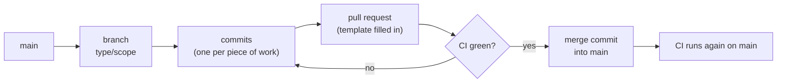

# ChillLog: branches, commits, pull requests and CI

> How changes get from an idea into `main`. The decisions behind it are in
> [architecture-and-stack.md](../architecture/architecture-and-stack.md) §15 (Repo) and §16 (Working
> process); the rules for AI tools are in [CLAUDE.md](../../CLAUDE.md).

## The flow



1. Start from an up-to-date `main` (`git pull`) and create a branch for **one** feature or fix.
2. Work in small, complete pieces. Each piece is one commit, and lint and tests pass before it's made.
3. Push the branch and open a pull request, filling in the template.
4. When CI is green, merge it yourself with a **merge commit**. Then switch back to `main` and pull.

Every change to `main` goes through a pull request: 27 so far. Three exceptions stay in the history as
they happened: the very first commit (the brief and architecture docs, before any code), the
`chore/scaffold` branch (merged locally, before pull requests were set up), and one fix (`34d665e`)
that was committed straight to `main` by mistake.

## Branches

**Name:** `type/scope`, lower case, with a dash between words.

| Type | For | Examples from this repo |
| --- | --- | --- |
| `feat/` | A new module, screen or feature | `feat/ingest`, `feat/ui-overview`, `feat/loggers-table` |
| `fix/` | A bug fix on its own | `fix/overview-branch-filter`, `fix/logger-sort-default` |
| `style/` | Look and feel only, no behavior change | `style/date-picker` |
| `docs/` | Documentation only | `docs/ui-spec`, `docs/database` |
| `ci/` | The CI workflow | `ci/skip-docs` |
| `chore/` | Setup and tooling | `chore/scaffold` |

**Rules:**

- **One branch per feature or fix.** The original build followed the order planned in
  architecture-and-stack.md §16 (database → registry → ingest → detection → API → seed → each screen →
  docs).
- **A bug found while building a feature is fixed on that feature's branch**, as its own commit, not
  on a new `fix/` branch. A separate `fix/` branch is for a bug found after its feature was merged.
- **Don't leave a branch half-done.** Before starting something new, merge (or knowingly park) the
  branch you're on.

## Commits

**Format:** [Conventional Commits](https://www.conventionalcommits.org/): a **name** (subject line)
and a **description** (body), written separately.

```text
fix(ui): list every branch from the database in the overview filter        ← name

The overview built its Branch and Type options from the overview's fridges, ← description
so a branch added in Setup with no fridges yet (Yoqneam Illit) was missing.
- Both lists now come from GET /api/branches (the database)...
```

- **Name:** `type(scope): what changed`, in the present tense and lower case, short enough to read in
  `git log --oneline`. Types: `feat`, `fix`, `style`, `docs`, `test`, `ci`, `chore`. Scopes used so
  far: `api`, `ingest`, `registry`, `detection`, `seed`, `server`, `client`, `ui`, `design`, `notes`,
  `ai-log`, `claude`.
- **Description:** why the change was needed, then what changed, as short lines or bullets. Someone
  reading `git log` a month later should understand it without opening the diff.

**Rules:**

- **One commit = one complete piece of work** that passes lint and tests on its own.
- **Tests go in the same commit as the code they test.** Tests are still written first and seen
  failing (see [testing.md](testing.md)), but a commit with failing tests is never made. The AI log's
  entry 1 is from before this rule, when the failing test was committed first.
- **A `fix/` branch is usually one commit.** Don't split a single fix into several.
- **History is never rewritten:** no `--amend`, no rebase of pushed commits, no force-push, no squash.
  A mistake is fixed by a new commit, and the old one stays visible.
- **The AI never commits, pushes or merges.** It stops after each piece and suggests a name and
  description; a person reviews the change and commits it by hand.
- **Line endings:** `.gitattributes` stores every text file with LF, so Windows and Linux (CI) see the
  same files.

## Pull requests

- **Open one per branch**, into `main`. The description follows
  [the template](../../.github/pull_request_template.md):

  | Section | What goes there |
  | --- | --- |
  | **What** | What the PR adds or changes, in a few lines |
  | **Decisions made** | Calls the docs didn't already settle, and why. Anything to ask Summer goes in NOTES.md too. |
  | **Tests** | Which tests cover it, naming the email case each one proves |
  | **AI notes** | What the AI wrote, what was rejected or corrected, and where to see it (commit, test, [AI log](../ai/ai-log.md) entry) |

- **Self-merged**, since this is a one-person project: review your own diff on GitHub first.
- **Merge only when CI is green**, with **"Create a merge commit"** (not squash, not rebase), so every
  PR's commits stay in `main` as they were made.
- **After merging:** switch to `main`, pull, and delete the branch if you like. Start the next branch
  from the updated `main`.

## CI: GitHub Actions

One workflow: [.github/workflows/ci.yml](../../.github/workflows/ci.yml).

**When it runs:**

- On every **pull request**, and on every **push to `main`** (so `main` is checked again after each
  merge).
- **Not when only docs change:** files under `docs/` and any `*.md` file are ignored. Lint, tests and
  the build don't read them, so running would only cost time. A docs-only PR shows no CI check; that's
  expected.

**What it does**, on Ubuntu with the Node version in `.nvmrc` (24):

| Step | Command | Fails when |
| --- | --- | --- |
| Install | `npm ci` | `package-lock.json` doesn't match `package.json` |
| Lint | `npm run lint` | ESLint finds a problem |
| Test | `npm test` | Any server or client test fails ([testing.md](testing.md)) |
| Build | `npm run build` | The client doesn't build |

npm's download cache is kept between runs, so installs are quick.

**When CI fails:** open the failed run from the PR's "Checks", find the failing step, fix it on the
same branch and push again. CI runs again by itself. Run the same commands locally first to save a
round trip:

```bash
npm run lint && npm test && npm run build
```

**CI runs on Linux, development happens on Windows.** Keep npm scripts cross-platform (no bash-only
syntax), and remember that file names are case-sensitive on Linux: an import of `./loggerTable.js`
for a file named `LoggerTable.jsx` works on Windows and fails in CI.

## Before you open a pull request

- [ ] The branch has one feature or fix, and is named `type/scope`.
- [ ] `npm run lint`, `npm test` and `npm run build` pass locally, and `npm run format` has been run.
- [ ] Each commit is one complete piece, with a Conventional Commit name and a description.
- [ ] The docs that describe the change are updated: [ui.md](../design/ui.md) for screens,
      [database.md](../architecture/database.md) for tables, [api.html](../architecture/api.html) for
      endpoints, [NOTES.md](../../NOTES.md) for decisions and questions.
- [ ] If the AI got something wrong, it has an entry in the [AI log](../ai/ai-log.md).
